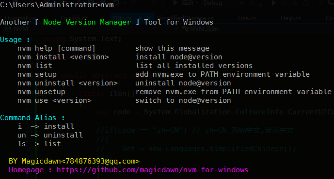
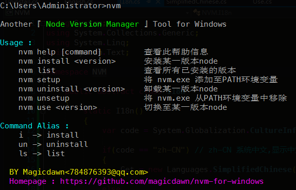

# Yep,another nvm for windows
Implement with C#,requires .NET Framework v4.0

[中文内容](#nvm-zh)

## Install
1. download a release zip file
2. unzip this file,ensure 3 files :
	- `Magicdawn.dll`
	- `NVM.exe`
	- `Ionic.Zip.dll`
3. open `cmd.exe` , switch this directory,run `nvm setup`

## Usage
1. install : install new version
2. use : switch specified version

## screenshot

# nvm-zh
中文介绍哈,为什么再造一个呢...因为C#是win上最好的语言,不服来辩呀!!!!

## 安装
1. 下载一个release的文件
2. 解压,确保下面三个文件:
	- `Magicdawn.dll`
	- `NVM.exe`
	- `Ionic.Zip.dll`
3. 打开命令行,cd到这个文件夹,运行`nvm setup`,添加到PATH

## Usage
1. nvm install : 安装一个版本
2. nvm use : 切换到某一版本

## 截图
